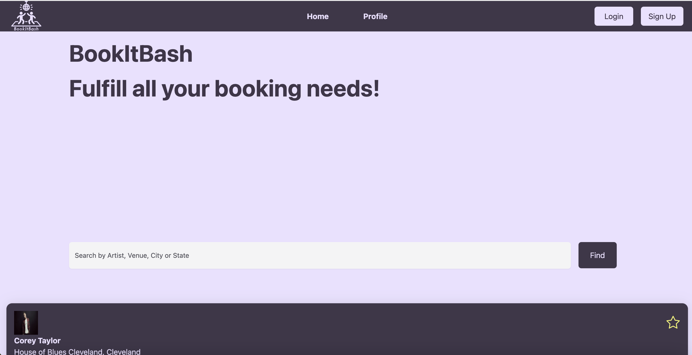
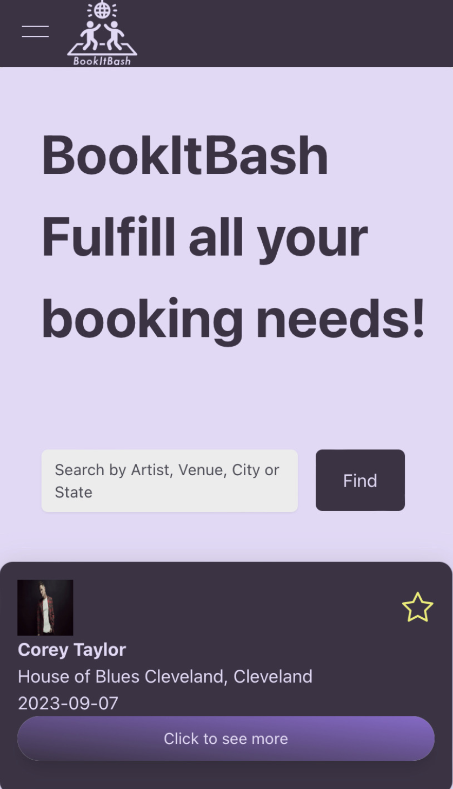

# BookItBash

## Description
 🎵 This application was designed with a focus on catering to music enthusiasts. Users can discover music events that match their specific search preferences.  🎵

## Table of Contents
- [Usage](#usage)
- [Links](#links)
- [Credits](#credits)
- [License](#license)

## Usage
Please click on the link to open it in your browser. Utilize the search bar to find events by artist, venue, city, or state, and explore the available options. To save an event and purchase tickets, the User will need to either create an account or log in to their existing profile. The User's profile includes a roster of saved events, if there are any. Additionally, the User has the option to remove events from their list.
    
**Website View**
 

**Mobile View**
 

## Links
 https://still-everglades-63170-224d574b2b5f.herokuapp.com/

## Credits
<a href="https://github.com/sucheta90">Sucheta Mukherjee</a>
 <a href="https://github.com/RyanTheSCholar">Ryan Bowen</a>
 <a href="https://github.com/lilym036">Lilibeth Neal</a>

**Technologies Used:**
 <a href="https://developer.ticketmaster.com/products-and-docs/">Ticketmaster API</a>
 <a href="https://nextui.org/">NextUI</a>
 ReactJS
 Vite
 Tailwind
 JSONwebtoken
 Axios
 ESLint
 Express
 Apollo Client & Server
 MongoDB
 Mongoose
 GraphQL

## License

MIT License

Copyright (c) 2023 Sucheta Mukherjee, Ryan Bowen, Lilibeth Neal

Permission is hereby granted, free of charge, to any person obtaining a copy
of this software and associated documentation files (the "Software"), to deal
in the Software without restriction, including without limitation the rights
to use, copy, modify, merge, publish, distribute, sublicense, and/or sell
copies of the Software, and to permit persons to whom the Software is
furnished to do so, subject to the following conditions:

The above copyright notice and this permission notice shall be included in all
copies or substantial portions of the Software.

THE SOFTWARE IS PROVIDED "AS IS", WITHOUT WARRANTY OF ANY KIND, EXPRESS OR
IMPLIED, INCLUDING BUT NOT LIMITED TO THE WARRANTIES OF MERCHANTABILITY,
FITNESS FOR A PARTICULAR PURPOSE AND NONINFRINGEMENT. IN NO EVENT SHALL THE
AUTHORS OR COPYRIGHT HOLDERS BE LIABLE FOR ANY CLAIM, DAMAGES OR OTHER
LIABILITY, WHETHER IN AN ACTION OF CONTRACT, TORT OR OTHERWISE, ARISING FROM,
OUT OF OR IN CONNECTION WITH THE SOFTWARE OR THE USE OR OTHER DEALINGS IN THE
SOFTWARE.

